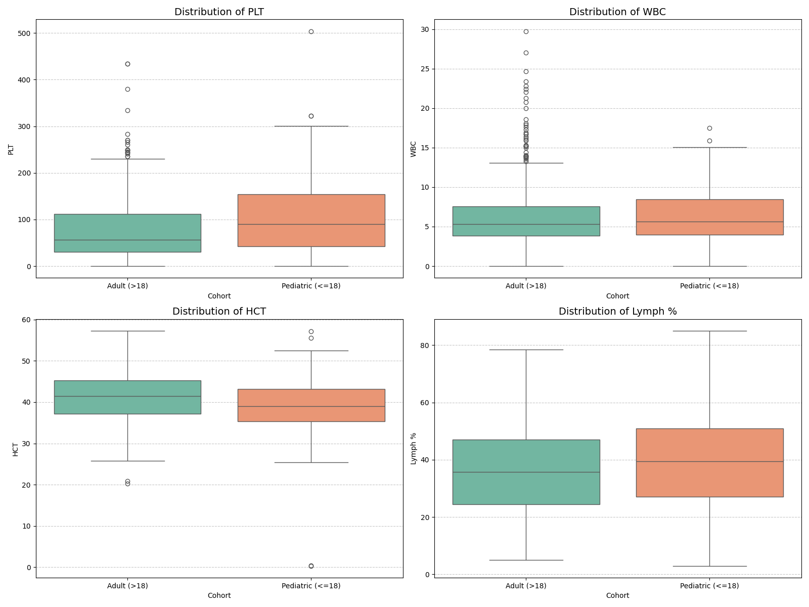
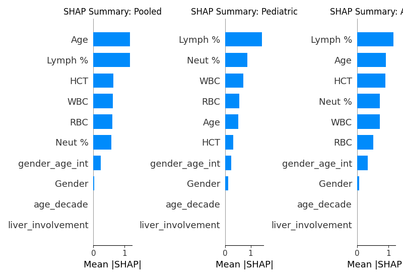
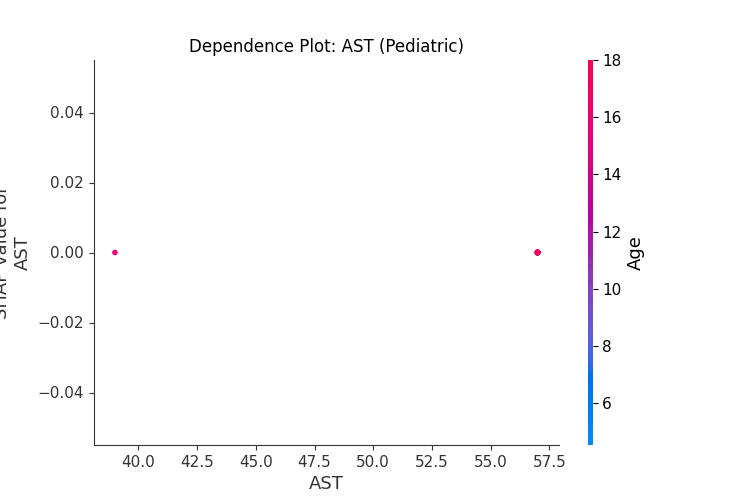
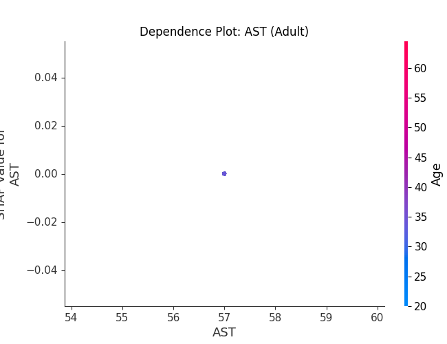
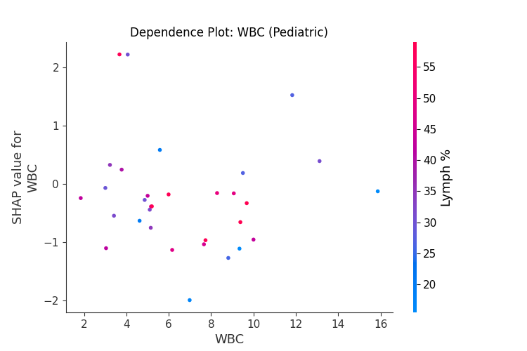
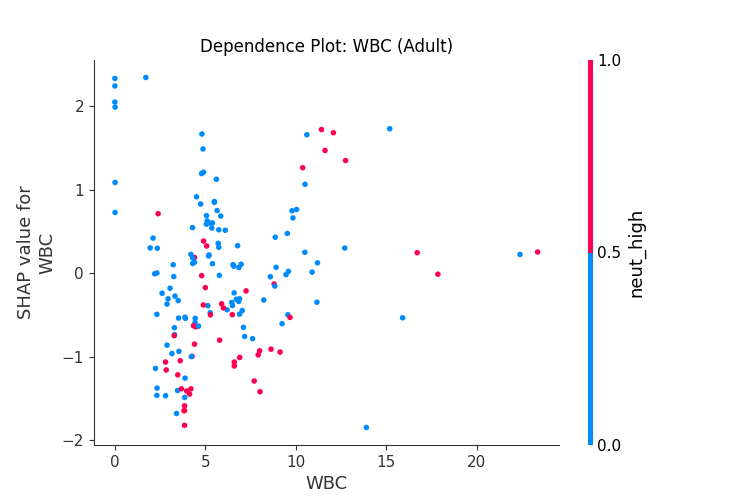

# Explainable Dengue Severity Prediction in Pediatric vs. Adult Cohorts

An age-stratified, explainable machine learning (xAI) framework and interactive clinical decision support system for early-stage dengue severity risk assessment using routine hematological and hepatic markers.

---

## 📌 Background

Dengue fever is an acute mosquito-borne viral infection that poses a catastrophic global healthcare burden, with pediatric and adult patients exhibiting fundamentally distinct pathophysiological trajectories and immune vulnerabilities. Conventional clinical triaging relies on uniform evaluation criteria, frequently underestimating pediatric immune fragility or overlooking adult-specific hepatic and hemoconcentration risk signals. To resolve this, this study introduces an age-stratified machine learning approach combined with localized SHapley Additive exPlanations (SHAP) that prevents data leakage, accurately stratifies risk, and reveals age-divergent physiological drivers of severe dengue.

---

## 🔬 Methodology

* **Cohort Stratification & Target Harmonization**:
  * Evaluated $N = 972$ NS1-confirmed dengue patient records from a comprehensive clinical hematology dataset from Bangladesh.
  * Patients were stratified into two distinct age cohorts: **Pediatric** ($\le 18$ years, $n=158$) and **Adult** ($>18$ years, $n=814$).
  * The clinical severity target is harmonized with the established Niazi & Momand proxy criteria (Severe: $\text{PLT} < 50,000/\mu\text{L}$; Non-Severe: $\text{PLT} \ge 50,000/\mu\text{L}$).

* **Leakage-Free Feature Engineering**:
  * Platelet counts and direct platelet-derived indices were strictly excluded from model feature sets to prevent circular data leakage.
  * Domain-specific physiological features were engineered: leukopenia indicator ($\text{WBC} < 4.0\times 10^3/\mu\text{L}$), lymphopenia ($\text{Lymph} < 20\%$), neutrophilia ($\text{Neut} > 70\%$), $\text{AST}/\text{ALT}$ ratio, liver involvement marker ($\text{AST} > 40$ or $\text{ALT} > 40\text{ U/L}$), age decade, and gender-age interactions.

* **Stratified Model Training & Optimization**:
  * Benchmarked five machine learning algorithms across Pooled, Pediatric, and Adult cohorts: **Logistic Regression (LR)**, **Random Forest (RF)**, **XGBoost (XGB)**, **LightGBM (LGBM)**, and **Stacking Classifier**.
  * Applied stratified 80/20 train-test splits with class-weight rebalancing and evaluated across Accuracy, AUC-ROC, Sensitivity, Specificity, F1-score, and Matthews Correlation Coefficient (MCC).

* **Model Explainability via SHAP**:
  * Implemented `shap.TreeExplainer` on the best-performing ensemble models to extract local attribution and global feature hierarchies.
  * Generated SHAP dependence plots with feature interaction overlays to pinpoint precise non-linear biomarker inflection thresholds.

* **Full-Stack Clinical Decision Support System**:
  * Developed a responsive web interface using **React 19**, **Recharts**, and **Lucide Icons** backed by a **FastAPI** / **SQLite** architecture.
  * Features real-time risk scores, dynamic SHAP waterfall visualizations, clinical platelet triage warnings, and longitudinal patient snapshot comparisons.

---

## 📊 Results & Key Findings

### 1. Hematological Distributions Across Cohorts (EDA)
Pediatric patients exhibit significantly lower median baseline WBC counts and distinct lymphocyte distributions compared to adults, confirming the physiological necessity of age-stratified modeling.

### 2. Model Performance Summary
Subgroup-specific models demonstrated marked superiority over pooled general models:

| Cohort | Best Model | AUC-ROC | Accuracy | Sensitivity | Specificity | F1-Score | MCC |
| :--- | :--- | :---: | :---: | :---: | :---: | :---: | :---: |
| **Pediatric ($\le 18$)** | **Random Forest** | **0.961** | **90.6%** | 66.7% | **100.0%** | **0.800** | **0.768** |
| Pediatric ($\le 18$) | **Stacking Classifier** | **0.947** | **90.6%** | 66.7% | **100.0%** | **0.800** | **0.768** |
| Pediatric ($\le 18$) | **XGBoost** | **0.899** | 84.4% | **77.8%** | 87.0% | 0.737 | 0.628 |
| **Adult ($>18$)** | **Random Forest** | **0.892** | **84.7%** | 78.1% | **90.0%** | **0.820** | **0.690** |
| Adult ($>18$) | **Stacking Classifier** | **0.882** | 83.4% | **79.5%** | 86.7% | 0.811 | 0.664 |
| Adult ($>18$) | **XGBoost** | **0.856** | 78.5% | **79.5%** | 77.8% | 0.768 | 0.570 |
| **Pooled (General)** | Random Forest | 0.860 | 79.0% | 69.9% | 85.7% | 0.739 | 0.566 |

### 3. Divergent Global SHAP Feature Importance
* **Pediatric Cohort**: Hematological and immune response markers ($\text{WBC}$, $\text{Lymph \%}$, $\text{Neut \%}$) are the primary contributors to severe dengue risk, highlighting rapid immune response kinetics in children.
* **Adult Cohort**: Hepatic markers ($\text{AST}$, $\text{ALT}$, $\text{AST/ALT ratio}$) along with hemoconcentration markers ($\text{HCT}$, $\text{RBC}$) predominate, reflecting mature organ involvement and vascular plasma leakage.

### 4. Non-Linear Biomarker Threshold Divergences

#### Hepatic Injury (AST Dependence)
* In **Pediatrics**, risk surges precipitously once AST exceeds $\sim 50\text{ U/L}$, signaling rapid hepatic vulnerability.
* In **Adults**, risk increases along a progressive slope with critical inflection beyond $80\text{ U/L}$.

| Pediatric AST Dependence | Adult AST Dependence |
| :---: | :---: |
|  |  |

#### Leukopenia (WBC Dependence)
* In **Pediatrics**, leukopenia ($\text{WBC} < 4.0\times 10^3/\mu\text{L}$) causes severe positive risk attribution.
* In **Adults**, WBC risk attribution follows a broader, multi-threshold profile.

| Pediatric WBC Dependence | Adult WBC Dependence |
| :---: | :---: |
|  |  |

---

## 🌐 Live Interactive Dashboard

Explore the real-time AI risk assessment engine, SHAP feature waterfalls, and patient longitudinal tracking online:

👉 **[Launch Live Dengue Risk Dashboard](https://dengue-severity-risk-assessment.vercel.app/)**
