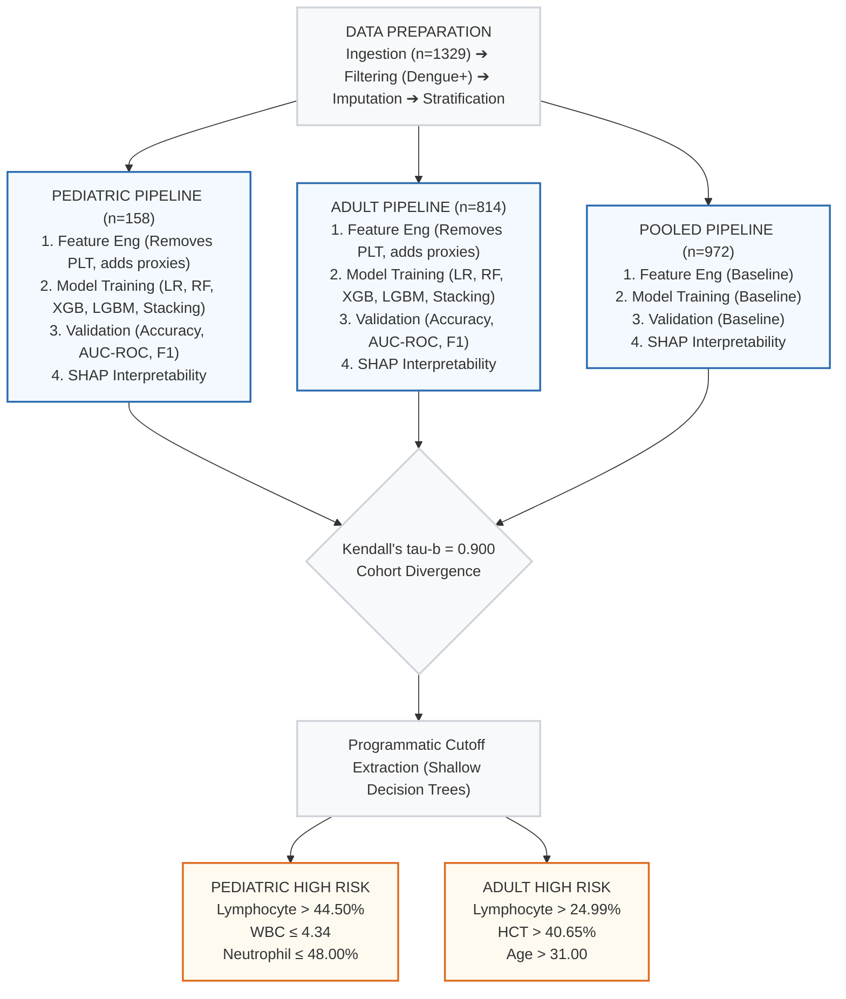

# Age-Stratified Dengue Severity Framework

## 1. Methodology & Dataset

* **Objective:** Identify divergent physiological drivers of Dengue severity between Pediatric ($\le$ 18) and Adult ($>$ 18) cohorts.
* **Dataset:** Mendeley Data - Comprehensive Dengue Hematology and Clinical Dataset from Bangladesh [2].
* **Approach:** Age-stratified Machine Learning framework involving pooled and subgroup-specific models, interpreted via localized SHAP analysis.
* **Severity Target Harmonization:** Severity is derived from platelet counts (Minor, Moderate, Severe) [10]. For binary classification, we use Severe vs. Non-Severe.

### 1.1 Data Preprocessing and Feature Engineering
* The methodology begins with data preprocessing (median imputation of missing values and filtering for dengue-positive cases) before splitting the dataset into pooled, pediatric, and adult cohorts.
* Feature engineering is applied domain-specifically for both pediatric and adult groups, focusing on key indicators like leukopenia and liver proxies [18], [19]. Explicitly, platelet count (PLT) and its direct derivatives were removed to prevent data leakage.
* An age-stratified modeling pipeline was constructed using the scikit-learn framework [20]. Separate classifiers (Logistic Regression, Random Forest [11], XGBoost [21], LightGBM [22], and Stacking Ensemble [23]) are trained for both subgroups to ensure model robustness.
* Post-training, shallow decision trees are applied to SHAP values [3] to programmatically extract actionable clinical cutoffs.
* The process concludes with a cohort-specific interpretation (using SHAP TreeExplainer and Kendall's tau-b correlation) to develop a multi-tier action plan for clinicians.

### 1.2 Cohort Distributions: Hematological Parameters by Age

*Fig. 1. Exploratory Data Analysis of key hematological parameters across cohorts.*

| Cohort | Age Range | Sample Size (n) |
| :--- | :--- | :--- |
| Pediatric | $\le$ 18 Years | 158 |
| Adult | $>$ 18 Years | 814 |

---

## 2. Model Performance

| Metric | Pediatric (Stacking) | Adult (Random Forest) | Significance |
| :--- | :--- | :--- | :--- |
| **Accuracy** | 90.6% | 84.7% | Validated cohort-specific manifestations. |
| **AUC-ROC** | 0.947 | 0.892 | |
| **F1-Score** | 0.800 | 0.820 | |

---

## 3. Age-Aware Clinical Framework

### 3.1 Side-by-Side SHAP Analysis

* The SHAP summary plots reveal distinct physiological drivers for dengue severity between pediatric and adult populations, validating the need for stratification [15].
* For pediatric patients, the analysis highlights that severity is primarily driven by fluctuations in Lymphocyte percentage and specific white blood cell thresholds.
* In the adult cohort, Hematocrit and Lymphocyte percentage emerge as the dominant predictive markers for severe outcomes.
* The Kendall’s tau-b correlation (0.900) between feature rankings indicates that while the two groups share some physiological markers, their specific thresholds and hierarchy of importance differ significantly, confirming the divergence captured by our age-stratified model.

*Fig. 2. SHAP summary comparison between Pooled, Pediatric, and Adult cohorts.*

### 3.2 Programmatic SHAP-Derived Clinical Threshold Extraction
By applying depth-1 decision trees to the SHAP outputs (where SHAP > 0 indicates elevated risk for severe dengue), we programmatically extracted the precise clinical cutoff thresholds:

#### **Pediatric High-Risk Cutoffs:**
* **Lymphocyte %:** High Risk when $>$ 44.50%
* **Neutrophil %:** High Risk when $\le$ 48.00%
* **WBC:** High Risk when $\le$ 4.34 cells/mm³

#### **Adult High-Risk Cutoffs:**
* **Lymphocyte %:** High Risk when $>$ 24.99%
* **Age:** High Risk when $>$ 31.00 years
* **Hematocrit (HCT):** High Risk when $>$ 40.65%

---

## 4. Feature Dependence Analysis

### A. WBC and Immune Response Analysis

  
  

*Fig. 3. SHAP dependence analysis for WBC: Pediatric vs. Adult.*

### B. Liver and AST Involvement

  
  

*Fig. 4. SHAP dependence analysis for AST across age groups.*

---

## References

[2] Mendeley Data, "Comprehensive Dengue Hematology and Clinical Dataset," 2026. [Online].

[3] S. M. Lundberg and S. I. Lee, "A unified approach to interpreting model predictions," in Advances in Neural Information Processing Systems (NeurIPS), vol. 30, 2017.

[10] M. Niazi and S. Momand, "Dengue Severity Level Prediction Using Hematology-Driven Machine Learning Models," Scientific Journal of Engineering, and Technology, vol. 3, no. 1, 2026.

[11] L. Breiman, "Random Forests," Machine Learning, vol. 45, no. 1, pp. 5-32, 2001.

[15] S. Rajapakse et al., "Clinical features of dengue in adults and children: A comparative study," Transactions of the Royal Society of Tropical Medicine and Hygiene, vol. 108, no. 1, pp. 24-29, 2014.

[18] M. L. N. N. et al., "Neutrophil-to-lymphocyte ratio and severe dengue: A prognostic indicator," Journal of Infection and Public Health, vol. 14, pp. 113-119, 2021.

[19] R. J. R. et al., "Hepatic Dysfunction in Dengue: Implications for Clinical Management," The American Journal of Tropical Medicine and Hygiene, vol. 104, no. 4, pp. 1245-1250, 2021.

[20] F. Pedregosa et al., "Scikit-learn: Machine Learning in Python," Journal of Machine Learning Research, vol. 12, pp. 2825-2830, 2011.

[21] T. Chen and C. Guestrin, "XGBoost: A Scalable Tree Boosting System," in Proc. of the 22nd ACM SIGKDD International Conference, 2016.

[22] G. Ke et al., "LightGBM: A Highly Efficient Gradient Boosting Decision Tree," in Advances in Neural Information Processing Systems, vol. 30, 2017.

[23] D. H. Wolpert, "Stacked generalization," Neural Networks, vol. 5, no. 2, pp. 241-259, 1992.
