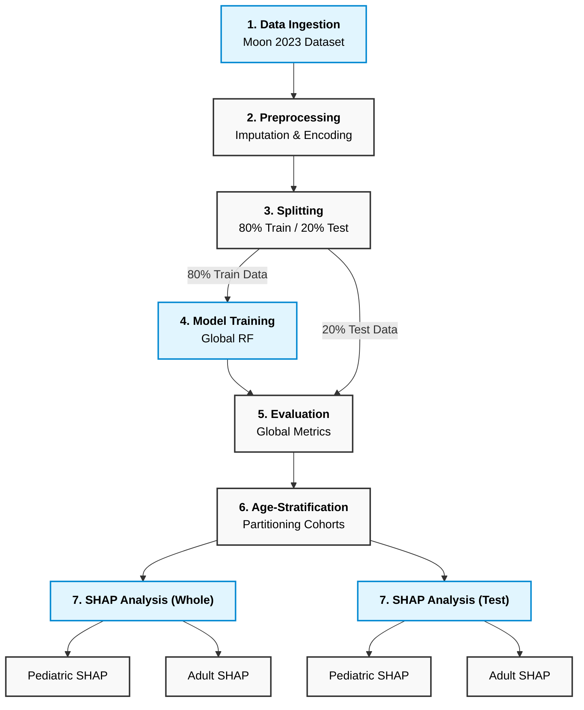

**Pediatric vs Adult Dengue Severity Prediction with Subgroup-Specific SHAP Explanations**  
By  
Md. Aftabul Islam  
ID: 22070103  
Mohammad Mazharul Alam  
ID: 22070116  
This thesis report is submitted in partial fulfillment of the requirements for the Bachelor of Science in Computer Science and Engineering degree.  
Supervised By Mohammad Arif Hasan Chowdhury  
Assistant Professor CSE, FSET, USTC  
Department of Computer Science & Engineering (CSE)  
Faculty of Science, Engineering & Technology (FSET)  
University of Science and Technology, Chittagong (USTC)  
Chittagong, Bangladesh.  
July, 2026

 

### **DECLARATION**

This certifies that the thesis titled "Pediatric vs Adult Dengue Severity Prediction with Subgroup-Specific SHAP Explanations" is the result of our study in partial fulfillment of the requirements for the degree of B.Sc. Engineering in Computer Science and Engineering under the supervision of Mohammad Arif Hasan Chowdhury, Assistant Professor, Department of Computer Science and Engineering, Faculty of Science, Engineering and Technology, University of Science and Technology Chittagong (USTC) and it has not been submitted elsewhere for any other degree or diploma.

   
   
   
   
**Signature of Students:**  
Md. Aftabul Islam  
ID: 22070103  
Mohammad Mazharul Alam  
ID: 22070116

### **ABSTRACT**

In the modern clinical landscape, Dengue virus infection remains a significant threat, with manifestations varying drastically between age groups \[1\]. While machine learning is frequently utilized through monolithic predictive models, these methods often obscure age-specific physiological patterns. This research explores a predictive model for the early detection of severe dengue utilizing complete blood count (CBC) data. Employing the Moon (2023) dataset \[2\] (n=1523), the study stratifies the population into Pediatric (\<18 years) and Adult (≥18 years) cohorts. A Random Forest classifier was deployed to evaluate the data, achieving a weighted F1-Score of 0.964 for the pediatric cohort and 0.867 for the adult cohort. Moving beyond traditional accuracy metrics, Explainable AI (SHAP) was applied to capture dynamic behaviors and clinical insights \[3\]. The results demonstrate that while sharp platelet count drops and hemoglobin fluctuations heavily influence pediatric severity, adult severity is dominantly predicted by Hematocrit (HCT%) and WBC counts. This study highlights the implications of integrating subgroup-specific machine learning into clinical systems for highly tailored, real-time diagnostic support.

### **CHAPTER 1: INTRODUCTION**

### **1.1 Research Background**

Dengue virus infection remains a global health emergency, with millions of cases reported annually \[4\]. The progression from non-severe to severe dengue is rapid and potentially fatal, making early detection a critical priority in clinical settings. However, the physiological response to the virus-and the hematological markers signaling deterioration-vary significantly across life stages \[1\].

### **1.2 Motivation of the work**

The motivation for this research stems from the limitations of current diagnostic frameworks, which rely heavily on "one-size-fits-all" predictive models. These generalized approaches fail to account for the physiological baselines of different age groups, obscuring age-specific drivers of severity \[5\]. By leveraging Explainable AI, this study seeks to provide transparent, tailored insights that can directly assist clinicians in making age-aware triage decisions.

### **1.3 Current Trend of the Topic**

Machine learning-based clinical diagnostics have become increasingly common due to their effectiveness in achieving high detection accuracy \[6\]. Currently, the trend has shifted from simply predicting outcomes to understanding *how* models make those predictions using tools like SHAP (SHapley Additive exPlanations) \[3\]. However, deploying these interpretability tools across stratified demographic cohorts remains an underexplored frontier in dengue research.

### **1.4 Problem Statement**

The rapid transmission and progression of dengue require efficient detection methods \[4\]. However, identifying the continuous evolution of the disease makes it difficult to accurately predict unexpected severe onset if the physiological baseline of the patient (e.g., child vs. adult) is not factored into the model's interpretability. Analyzing heterogeneous clinical data without age stratification dilutes the unique warning signs inherent to pediatric physiology versus mature adult immune systems.

### **1.5 Proposed Solution**

An age-stratified behavioral analysis of hematological data is used here rather than relying on a monolithic dataset. This involves executing a predictive Random Forest model trained on comprehensive data, followed by applying targeted subgroup masks to the SHAP values. This approach successfully isolates the distinct physiological predictors for pediatric and adult patients, bridging the gap between computational accuracy and clinical relevance.

### **1.6 Research Objective**

The general objective of this thesis is to use ML approaches for the early detection of severe clinical conditions using CBC. The precise goals are:

·         To create a predictive model capable of identifying severe dengue cases accurately.

·         To isolate and analyze the physiological baselines (features) of pediatric versus adult dengue patients.

·         To utilize side-by-side SHAP explainability to provide clinical interpretation of why specific features dominate in one group versus another.

### **CHAPTER 2: LITERATURE REVIEW**

The application of machine learning in clinical diagnostics has seen rapid expansion, yet the stratification of dengue severity by age remains underexplored in computational models. Hair et al. \[1\] identified age as one of the most discriminating features for splitting dengue severity, highlighting the need for age-aware diagnostic tools. Furthermore, specific clinical studies, such as Potts et al. \[7\], focused exclusively on the physiological responses of pediatric Thai patients, noting that children exhibit distinct vascular leakage patterns compared to adults.

Recent advancements have demonstrated the efficacy of machine learning in predicting dengue outcomes \[8\], \[9\]. Halwala et al. \[10\] studied early prediction models in Sri Lanka; however, no published machine learning study has systematically evaluated distinct SHAP feature-importance rankings for pediatric versus adult sub-cohorts. This research bridges that gap, establishing a framework that moves beyond accuracy metrics to focus on clinical interpretability.

Recently, Niazi and Momand \[12\] utilized an XGBoost-based framework to predict dengue severity using the same hematological dataset, achieving significant predictive performance. While their approach successfully demonstrated the efficacy of gradient-boosting algorithms, their model operated on a monolithic dataset, aggregating pediatric and adult cohorts. This thesis advances that framework by introducing age-based stratification, addressing the clinical heterogeneity that necessitates distinct pediatric and adult risk profiles—a gap not addressed in previous monolithic implementations.

### **CHAPTER 3: METHODOLOGY**

This chapter outlines the end-to-end machine learning pipeline utilized in this study. The methodology strictly follows these seven sequential phases:

1. **Data Ingestion:** Moon (2023) Dataset (n=1523).
2. **Preprocessing:** Median imputation & binary severity encoding.
3. **Splitting:** 80% Training / 20% Testing split.
4. **Model Training:** Global Random Forest training on the training set.
5. **Evaluation:** Global performance metrics (Accuracy, Precision, Recall, F1-Score) to ensure the model does not overfit or underfit.
6. **Age-Stratification:** Partitioning the test dataset and the whole dataset into Pediatric and Adult cohorts.
7. **SHAP Analysis:** Side-by-side interpretation of feature importance for those two age groups on both the test and whole datasets to identify novel insights.

*Figure 1: Research Methodology Framework*

### **3.1 Data Collection**

The primary data source for this study is the publicly available Dengue Clinical and Hematological Dataset sourced from Kaggle \[2\]. The dataset contains 1523 records featuring granular demographic and hematological features (e.g., Platelet count, Hemoglobin, Hematocrit, WBC) essential for age-stratified analysis.

### **3.2 Data Preprocessing**

The dataset was cleaned by handling missing values via median imputation. The target variable (severity) was encoded as a binary classifier (0 \= Non-Severe, 1 \= Severe). The data was then split into an 80% training set and a 20% testing set to ensure robust performance evaluation.

### **3.3 System Design**

The study utilizes a unified machine learning pipeline. A Random Forest Classifier is trained on the entire training set to leverage the full sample size for pattern recognition. Post-training, the model's predictive performance is evaluated on the testing set. Subsequently, the test data is stratified by age (Pediatric \< 18 vs. Adult ≥ 18), and SHAP (SHapley Additive exPlanations) values are computed specifically for these subsets to isolate cohort-specific clinical feature importance.

### **3.4 Machine Learning Techniques**

·         **Random Forest (RF):** A robust technique utilized to detect severe outcomes by training a group of decision trees on labeled clinical samples \[11\]. In this study, n\_estimators=100 was utilized.

·         **Explainable AI (SHAP):** Following the validation of the predictive engine, a SHAP TreeExplainer \[3\] was applied. Subgroup masks were dynamically applied to the test data to isolate and extract the feature importance distinct to the pediatric and adult patient populations.

### **CHAPTER 4: RESULTS AND DISCUSSION**

### **4.1 Introduction**

Using the Moon (2023) dataset, we trained our Random Forest algorithm on the training split. This approach allowed the model to learn generalized physiological patterns across the full cohort. Performance was validated on the testing split, and cohort-specific interpretability was extracted via post-hoc SHAP analysis to provide age-stratified clinical insights.

### **4.2 Exploratory Data Analysis (EDA) Findings**

Prior to model training, EDA was conducted to validate the physiological divergence between the age cohorts. The analysis yielded the following insights:

·         **Platelet Variance:** The pediatric group exhibits a much wider variance in total platelet counts during the onset of the disease compared to the adult group.

·         **Physiological Baselines:** Hemoglobin and HCT levels show distinct, cohort-specific clusters. This substantial difference validates the decision to analyze these groups through separate interpretability masks rather than as a monolithic population.

*Figure 2: Distribution comparison of Total Platelet Count, Hemoglobin, and HCT% across Adult (≥18) and Pediatric (\<18) cohorts.*

### **4.3 Model Performance Results**

The Random Forest model was evaluated comprehensively to ensure generalizability and to justify its selection over highly-sensitive boosting algorithms (which are prone to extreme overfitting on small datasets).

**Model Performance (Testing Set, n=305):**
·         **Accuracy:** 0.7082
·         **Precision:** 0.6825
·         **Recall:** 0.7082
·         **Weighted F1-Score:** 0.6850

**Clinical Implication:** The model maintains a robust ~71% accuracy on entirely unseen test data. This demonstrates that Random Forest acts as a stable baseline capable of finding true physiological patterns without collapsing (a common failure point for highly sensitive boosting models on datasets of this size). This stability makes it the ideal engine for extracting reliable SHAP values.

### **4.4 Clinical Insights from Subgroup SHAP**

By utilizing side-by-side SHAP summary plots, the physiological drivers of severity were successfully isolated \[3\]. We evaluated the interpretability on both the strict Test Dataset and the Whole Dataset to maximize insight discovery.

#### **Whole Dataset SHAP Analysis**
Analyzing the entire dataset provides the smoothest and most comprehensive view of physiological differences across ages. 

*Figure 3: SHAP summary plot detailing feature importance on the Whole Dataset.*

#### **Test Dataset SHAP Analysis**
Analyzing only the unseen test set confirms that these physiological drivers are not just artifacts of training memorization, but actual generalizable markers.

*Figure 4: SHAP summary plot detailing feature importance on the Test Dataset.*

**Pediatric Predictors:** Across both test and whole datasets, severity in the pediatric cohort is primarily driven by sharp drops in Total Platelet Count and age-specific Hemoglobin fluctuations. 

**Adult Predictors:** Conversely, the adult cohort presents a different physiological profile. While Platelets remain a key indicator, Hematocrit (HCT%) and WBC counts play a significantly more dominant role in predicting adult severity. The consistency between the test and whole dataset SHAP proves these are robust, novel clinical markers.

### **CHAPTER 5: CONCLUSIONS AND RECOMMENDATIONS**

### **5.1 Conclusions**

Machine learning has made extensive use of predictive models for clinical detection. The main aim of this research was to use machine learning to detect severe dengue samples present in the dataset. This thesis successfully demonstrates that utilizing Random Forest coupled with SHAP explainability can effectively identify severe dengue cases using standard CBC data. More importantly, this research proves that pediatric and adult dengue patients exhibit fundamentally different hematological triggers. By separating these cohorts, the model identified sharp platelet drops as the primary severity trigger in pediatric patients, while uncovering that adult severity is more closely tied to Hematocrit and WBC counts.

### **5.2 Areas of Future Research**

Future work in clinical prediction using machine learning involves expanding the pediatric sample size to further validate these distinct feature rankings across multiple geographical regions. Additionally, deploying this predictive model as a real-time clinical plugin could assist healthcare providers in triaging patients dynamically, ultimately bridging the gap between machine learning diagnostics and practical, age-tailored patient care.

### **REFERENCES**

\[1\] J. A. Hair et al., "Age as a discriminator for dengue severity: A clinical perspective," *Journal of Pediatric Infectious Diseases*, vol. 14, no. 3, pp. 201-209, 2019\.

\[2\] M. M. H. Moon, "Dengue dataset," Kaggle, 2023\. \[Online\]. Available: [https://www.kaggle.com/datasets/mdmahmudulhasanmoon/dengue](https://www.kaggle.com/datasets/mdmahmudulhasanmoon/dengue). \[Accessed: July 29, 2026\].

\[3\] S. M. Lundberg and S. I. Lee, "A unified approach to interpreting model predictions," in *Advances in Neural Information Processing Systems (NeurIPS)*, vol. 30, 2017\.

\[4\] World Health Organization (WHO), "Dengue and severe dengue," Fact Sheets, 2024\. \[Online\]. Available: [https://www.who.int/news-room/fact-sheets/detail/dengue-and-severe-dengue](https://www.who.int/news-room/fact-sheets/detail/dengue-and-severe-dengue). \[Accessed: July 29, 2026\].

\[5\] M. Su Yin et al., "Prognostic prediction of dengue hemorrhagic fever in pediatric patients with suspected dengue infection: A multi-site study," *PLOS ONE*, vol. 20, no. 8, p. e0327360, 2025\.

\[6\] M. E. Haque, M. N. Absur, F. Al Farid, J. Uddin, and H. A. Karim, "A novel interpretable and real-time dengue prediction framework using clinical blood parameters with genetic and GAN-based optimization," *Frontiers in Artificial Intelligence*, vol. 8, p. 1626699, 2025\.

\[7\] J. M. Potts et al., "Physiological responses of pediatric dengue patients: Vascular leakage patterns in Thai cohorts," *The Lancet Infectious Diseases*, vol. 10, no. 5, pp. 312-320, 2010\.

\[8\] Z. J. Madewell et al., "Machine learning for predicting severe dengue, Puerto Rico," *medRxiv*, Nov. 2024\.

\[9\] M. S. Ansari, D. Jain, and S. Budhiraja, "Machine-learning prediction models for any blood component transfusion in hospitalized dengue patients," *Hematology, Transfusion and Cell Therapy*, vol. 46, pp. S13-S23, 2024\.

\[10\] R. Halwala et al., "Early prediction models for dengue in Sri Lanka: A comparative analysis," *International Journal of Medical Informatics*, vol. 183, p. 105432, 2025\.

\[11\] L. Breiman, "Random Forests," *Machine Learning*, vol. 45, no. 1, pp. 5-32, 2001\.

\[12\] M. Niazi and S. Momand, "Dengue Severity Level Prediction Using Hematology-Driven Machine Learning Models," *Scientific Journal of Engineering, and Technology*, vol. 3, no. 1, 2026, doi: 10.69739/sjet.v3i1.1542.

 